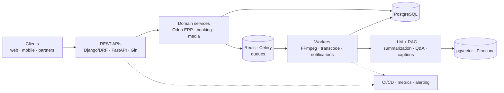

---

I lead the engineering team at **Faraatar**, building Odoo-based ERP and internal platforms.
**7+ years** of professional Python backend, **10+ years** programming, **2+ years** leading teams —
across ERP automation, AI-enabled products, and high-traffic media platforms.

I own delivery end to end: discovery, technical design, estimation, implementation, testing,
release, and post-launch monitoring.

---

## What I build

Event-driven microservices, decoupled from the request path, with DDD and Clean Architecture
where it earns its keep — and an RFC circulated before the code gets written.

---

## Impact

| | |
|---|---|
| **3M+ users** | Baazigooshi — B2B web gaming platform, delivered for Namava, Digikala, Zarebin |
| **15–20s → 2–6s** | Golden Key API latency, a ~70–85% cut via query tuning, caching, and Redis/Celery |
| **7+ / 10+ / 2+** | years of professional backend / programming / leading engineering teams |

---

## Selected work

| Project | What it is |
|---|---|
| [**OdooPro**](https://odoopro.ir) | Faraatar's flagship ERP product — Odoo modules, workflow automation, integrations |
| [**Baazigooshi**](https://baazigooshi.com) | B2B web gaming platform at 3M+ users — content management, analytics, integrations |
| [**Azad**](https://azad.im) | AI social platform — LLM summarization, contextual Q&A, transcription, captioning |
| [**Gardima**](https://gardima.ir) | Travel booking in Go (Gin) + React Native — plane, train, bus, hotel |
| **Converter API** | Go video/audio service — transcoding, editing, playback, integration workflows |
| **iTunes · Chaargoosh · Videaneh** | Streaming, subscriptions, purchases, encoding, high-volume media delivery |

---

## Stack

**Now — backend, AI, infrastructure**

`LLM integrations` · `RAG / retrieval assistants` · `prompt engineering` · `LlamaIndex` · `OpenAI APIs` · `n8n` · `MCP`

**Before backend — mobile, games, data**

I didn't start here. Before the backend years I shipped iOS and Android apps and worked on games,
and that's still where a lot of my product instinct comes from.

---

## How I work

- **RFCs before code.** Service layout, integration events, and trade-offs get written down and peer-reviewed first.
- **Staging mirrors production.** Every release is validated manually and automatically before rollout.
- **I watch the graphs after launch** — and follow every reported issue through to confirmed resolution with the reporter.
- **Scope is a conversation.** Estimates, roadmaps, and delivery commitments are negotiated, not guessed.
- **Mentoring is part of shipping.** Architecture review, pairing, code review — plus ~1 year teaching Django at Maktab Sharif & Quera.

---

## Activity

---

**Open to senior backend, AI, and tech-lead roles.**

[amirkiankiani@icloud.com](mailto:amirkiankiani@icloud.com) · [amirkiankiani.ir](https://www.amirkiankiani.ir) · Tehran, Iran

